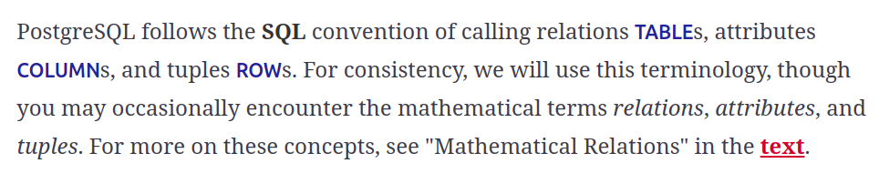
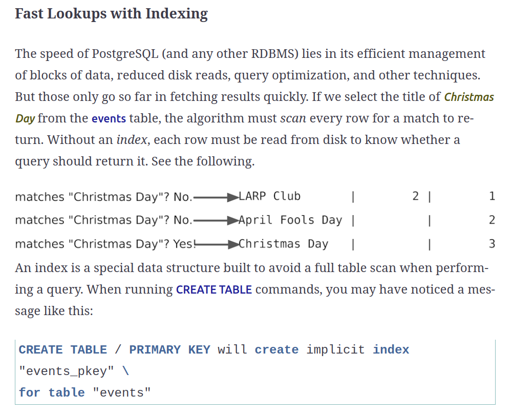

# Introduction

- To run Postgres:
```bash
docker run --name my-local-postgres -p 5432:5432 -e POSTGRES_PASSWORD=tops3cr3tpass -d postgres
```



# Day 1

Playground:
```sql

create database store;

SELECT session_user, current_database();

/* lets create some tables */

drop table if exists authors;
drop table if exists publishers;
drop table if exists books;
drop table if exists notes;

create table authors (
    id int primary key,
    name varchar(256) unique not null,
    bio text
);

create table publishers (
    code char(3) primary key,
    name varchar(256) not null,
    description text
);

create table books (
    code int primary key,
    title varchar(256) unique,
    description text,
    author_id int references authors,
    publisher_code char(3) references publishers
);

create table notes (
    id int primary key,
    book_code int references books,
    note text not null
);

/* lets insert some data */
INSERT INTO authors (id, name, bio) VALUES
(1, 'Frederick P. Brooks Jr.', 'Author of "The Mythical Man-Month", known for insights into software project management.'),
(2, 'Donald E. Knuth', 'Author of "The Art of Computer Programming", an influential work in computer science.'),
(3, 'Martin Fowler', 'Author of "Refactoring: Improving the Design of Existing Code", renowned for his work on software design patterns and agile software development.'),
(4, 'Eric Evans', 'Author of "Domain-Driven Design: Tackling Complexity in the Heart of Software", known for his work on domain-driven design.');

INSERT INTO publishers (code, name, description) VALUES
('ADD', 'Addison-Wesley', 'A publisher known for its high-quality computer science and engineering texts.'),
('MIT', 'MIT Press', 'An academic publisher known for publishing cutting-edge research in computer science and technology.'),
('OXR', 'Oxford University Press', 'A renowned publisher with a wide range of academic and educational publications.');

INSERT INTO books (code, title, description, author_id, publisher_code) VALUES
(101, 'The Mythical Man-Month', 'Essays on software engineering and project management', 1, 'ADD'),
(102, 'The Art of Computer Programming', 'A comprehensive monograph written by Donald Knuth', 2, 'ADD'),
(103, 'Refactoring: Improving the Design of Existing Code', 'A book on software development and software engineering principles', 3, 'OXR');

INSERT INTO notes (id, book_code, note) VALUES
(1, 101, 'Highlights the importance of time estimation in software projects.'),
(2, 102, 'Considered one of the most comprehensive works in the field of algorithmic programming.'),
(3, 103, 'Introduces the concept of code smells and provides practical techniques for refactoring.');

insert into books
    (code, title, description)
values
    (1, 'Learning Domain Driven Design', 'Great DDD Book'),
    (2, 'Seven Databases in Seven Days', 'Great to learn more about databases');

/* lets get some data */

select * from books;
select * from authors;
select * from books inner join authors on books.author_id = authors.id;
select * from books left outer join authors on books.author_id = authors.id;
select * from books right outer join authors on books.author_id = authors.id;

/* indexes */

create index books_date on books (published_at);
create index books_author_2 on books using btree (column);
create index books_author_3 on books using hash (column);

```



### B-tree index

A good standard index; values are stored as a balanced tree data structure; very flexible; B-tree indexes are the default in Postgres

### Hash index

Another good standard index in which each index value is unique; hash indexes tend to offer better performance for comparison operations than B-tree indexes but are less flexible and don’t allow for things like range queries

# Day 1 Home Work:

### Find

- OK - Find the PostgreSQL documentation online and bookmark it.
- OK - Acquaint yourself with the command-line \? and \h output.
- OK - We briefly mentioned the MATCH FULL constraint. Find some information on the other available types of MATCH constraints.

### Do

- OK - Select all the tables we created (and only those) from pg_class and examine the table to get a sense of what kinds of metadata Postgres stores about tables.
- OK - Write a query that finds the country name of the Fight Club event.
- OK - Alter the venues table such that it contains a Boolean column called active with a default value of TRUE.
- OK - Understand better about the types of indexes for RDBMS
- OK - Understand the B-tree and its function well
- OK - Understand the Hash index and its function well

## Notes

#### Index types

In PostgreSQL, several types of indexes are available, each serving a specific use case. Understanding when to use each type of index is crucial for optimizing database performance. Here's a brief overview:

- B-tree Indexes: The most common type of index in PostgreSQL. They are efficient for equality and range queries. You should use B-tree indexes for columns that are often used in comparison operations (like =, <, >, <=, >=) and in ORDER BY clauses.

- Hash Indexes: Suitable for simple equality comparisons. They can be more efficient than B-tree for these types of operations, but they don't support range queries. Use hash indexes for columns where you only perform equality comparisons (=).

- GiST (Generalized Search Tree) Indexes: These are versatile and can support various types of searches, including multi-dimensional data and complex types like polygons. GiST indexes are ideal for spatial data (used with PostGIS), full-text search, and overlapping ranges.

- GIN (Generalized Inverted Index) Indexes: Useful for indexing composite values where an item can be part of multiple values. They are typically used for full-text search and indexing array data. Use GIN indexes when you need to index elements within composite types like arrays or JSONB.

- BRIN (Block Range INdexes): Designed for very large tables where data is naturally ordered. They store summaries of values in blocks of rows. BRIN indexes are suitable for large datasets where the data has some natural correlation with physical storage order, like timestamps on a logging table.

- SP-GiST (Space-Partitioned Generalized Search Tree) Indexes: These are for partitioning data into a non-overlapping space. They are useful for data that doesn't fit well into a B-tree structure, like tree structures or partitioned data.

- Bloom Filters: A probabilistic data structure that can efficiently test whether an element is part of a set. They are used for compactly representing a set of values, primarily when you have many indexable columns and queries that test these columns in various combinations.

When choosing an index type, consider factors like the size and type of data, the nature of queries (equality, range, pattern matching, etc.), and the frequency of data modification. Proper indexing can significantly improve query performance, but it's also important to avoid over-indexing, as this can lead to increased storage requirements and slower write operations.

#### Match types

A value inserted into the referencing column(s) is matched against the values of the referenced table and referenced columns using the given match type. There are three match types: MATCH FULL, MATCH PARTIAL, and MATCH SIMPLE (which is the default). MATCH FULL will not allow one column of a multicolumn foreign key to be null unless all foreign key columns are null; if they are all null, the row is not required to have a match in the referenced table. MATCH SIMPLE allows any of the foreign key columns to be null; if any of them are null, the row is not required to have a match in the referenced table. MATCH PARTIAL is not yet implemented. (Of course, NOT NULL constraints can be applied to the referencing column(s) to prevent these cases from arising.)

# Day 2

## Aggregate functions

A more readable way of inserting relations:

```sql
INSERT INTO books 
    (code, title, published_at, description, author_id, publisher_code) 
VALUES
    (130, 'Another Evans` book', '2021-01-01', 'Testing...',        
        (select id from authors where name = 'Eric Evans'), 
    'ADD');
```

Simple count aggregate functiom:

```sql
select count(*) from books;
```

There other aggregate functions like: sum, avg, min, max, etc.

Grouping data:

```sql
select author_id, count(*) from books group by author_id;
```

Filtering after gouping with HAVING:
    
```sql
select
    author_id, a.name, count(*) as qtd
from books
    inner join authors a
        on books.author_id = a.id
group by
    author_id, a.name, author_id
having
    count(*) > 1;
```

Also, there is the distinct keyword to remove duplicates:

```sql
select distinct author_id from books;
```

### Transactions

Transactions are the bulwark of relational database consistency. All or nothing, that’s the transaction motto. Transactions ensure that every command of a set is executed. If anything fails along the way, all of the commands are rolled back as if they never happened.

PostgreSQL transactions follow ACID compliance, which stands for:

- Atomic (either all operations succeed or none do)
- Consistent (the data will always be in a good state and never in an inconsistent state)
- Isolated (transactions don’t interfere with one another)
- Durable (a committed transaction is safe, even after a server crash)

### Stored Procedures

Every command we’ve seen until now has been declarative in the sense that we‘ve been able to get our desired result set using just SQL (which is quite powerful in itself). But sometimes the database doesn‘t give us everything we need natively and we need to run some code to fill in the gaps. At that point, though, you need to decide where the code is going to run. Should it run in Postgres or should it run on the application side?

```sql
CREATE​ ​OR​ ​REPLACE​ ​FUNCTION​ add_event(
​ 	  title ​text​,
​ 	  ​starts​ ​timestamp​,
​ 	  ​ends​ ​timestamp​,
​ 	  venue ​text​,
​ 	  postal ​varchar​(9),
​ 	  country ​char​(2))
​ 	​RETURNS​ ​boolean​ ​AS​ ​$$​
​ 	​DECLARE​
​ 	  did_insert ​boolean​ := ​false​;
​ 	  found_count ​integer​;
​ 	  the_venue_id ​integer​;
​ 	​BEGIN​
​ 	  ​SELECT​ venue_id ​INTO​ the_venue_id
​ 	  ​FROM​ venues v
​ 	  ​WHERE​ v.postal_code=postal ​AND​ v.country_code=country ​AND​ v.​name​ ILIKE venue
​ 	  ​LIMIT​ 1;
​ 	
​ 	  ​IF​ the_venue_id ​IS​ ​NULL​ ​THEN​
​ 	    ​INSERT​ ​INTO​ venues (​name​, postal_code, country_code)
​ 	    ​VALUES​ (venue, postal, country)
​ 	    RETURNING venue_id ​INTO​ the_venue_id;
​ 	
​ 	    did_insert := ​true​;
​ 	  ​END​ ​IF​;
​ 	
​ 	  ​-- Note: this is a notice, not an error as in some programming languages​
​ 	  RAISE NOTICE ​'Venue found %'​, the_venue_id;
​ 	
​ 	  ​INSERT​ ​INTO​ ​events​ (title, ​starts​, ​ends​, venue_id)
​ 	  ​VALUES​ (title, ​starts​, ​ends​, the_venue_id);
​ 	
​ 	  ​RETURN​ did_insert;
​ 	​END​;
​ 	​$$​ ​LANGUAGE​ plpgsql;
```

### Pull the Triggers

Triggers automatically fire stored procedures when some event happens, such as an insert or update. They allow the database to enforce some required behavior in response to changing data.

```sql
​ 	​CREATE​ ​TABLE​ ​logs​ (
​ 	  event_id ​integer​,
​ 	  old_title ​varchar​(255),
​ 	  old_starts ​timestamp​,
​ 	  old_ends ​timestamp​,
​ 	  logged_at ​timestamp​ ​DEFAULT​ ​current_timestamp​
​ 	);

/* LOG_EVENT.SQL */
CREATE​ ​OR​ ​REPLACE​ ​FUNCTION​ log_event() ​RETURNS​ ​trigger​ ​AS​ ​$$​
​ 	​DECLARE​
​ 	​BEGIN​
​ 	  ​INSERT​ ​INTO​ ​logs​ (event_id, old_title, old_starts, old_ends)
​ 	  ​VALUES​ (OLD.event_id, OLD.title, OLD.​starts​, OLD.​ends​);
​ 	  RAISE NOTICE ​'Someone just changed event #%'​, OLD.event_id;
​ 	  ​RETURN​ ​NEW​;
​ 	​END​;
​ 	​$$​ ​LANGUAGE​ plpgsql;

/* CREATE TRIGGER */
​ 	​CREATE​ ​TRIGGER​ log_events
​ 	  ​AFTER​ ​UPDATE​ ​ON​ ​events​
​ 	  ​FOR​ ​EACH​ ​ROW​ ​EXECUTE​ ​PROCEDURE​ log_event();
```

### Viewing the World

Wouldn’t it be great if you could use the results of a complex query just like any other table? Well, that’s exactly what VIEWs are for. Unlike stored procedures, these aren’t functions being executed but rather aliased queries. Let’s say that we wanted to see only holidays that contain the word Day and have no venue. We could create a VIEW for that like this:

```sql
create view summary as
    select books.code as code, authors.id as author_id, authors.name, books.title from books inner join authors on books.author_id = authors.id;

select * from summary where code = 101
```

### Materialized Views

Though VIEWs like the holidays view mentioned previously are a convenient abstraction, they don’t yield any performance gains over the SELECT queries that they alias. If you want VIEWs that do offer such gains, you should consider creating materialized views, which are different because they’re stored on disk in a “real” table and thus yield performance gains because they restrict the number of tables that must be accessed to exactly one.

You can create materialized views just like ordinary views, except with a CREATE MATERIALIZED VIEW rather than CREATE VIEW statement. Materialized view tables are populated whenever you run the REFRESH command for them, which you can automate to run at defined intervals or in response to triggers. You can also create indexes on materialized views the same way that you can on regular tables.

```sql
/* materialized views */
create materialized view overview as
    select books.code as code, authors.id as author_id, authors.name, books.title from books inner join authors on books.author_id = authors.id;

select * from overview;

refresh materialized view overview;

INSERT INTO books (code, title, published_at, description, author_id, publisher_code) VALUES
(105, 'Another great book', '2021-01-01', 'Great one', 1, 'ADD'),
(106, 'Amazing book!', '2019-01-01', 'Amazing one', 2, 'ADD');
```

# Day 3

### SQL Standard String Matches

PostgreSQL has many ways of performing text matches but the two major default methods are LIKE and regular expressions.

LIKE and ILIKE are the simplest forms of text search (ILIKE is a case-insensitive version of LIKE). They are fairly universal in relational databases. LIKE compares column values against a given pattern string. The % and _ characters are wildcards: % matches any number of any characters while _ matches exactly one character.

### Regex

A more powerful string-matching syntax is a regular expression (regex). Regexes appear often throughout this book because many databases support them. There are entire books dedicated to writing powerful expressions—the topic is far too wide and complex to cover in depth here. Postgres conforms (mostly) to the POSIX style.

In Postgres, a regular expression match is led by the ~ operator, with the optional ! (meaning not matching) and * (meaning case insensitive). To count all movies that do not begin with the, the following case-insensitive query will work. The characters inside the string are the regular expression.

### Bride of Levenshtein

Levenshtein is a string comparison algorithm that compares how similar two strings are by how many steps are required to change one string into another. Each replaced, missing, or added character counts as a step. The distance is the total number of steps away. In PostgreSQL, the levenshtein function is provided by the fuzzystrmatch contrib package. Say we have the string bat and the string fads.

### Try a Trigram

A trigram is a group of three consecutive characters taken from a string. The pg_trgm contrib module breaks a string into as many trigrams as it can.

Finding a matching string is as simple as counting the number of matching trigrams. The strings with the most matches are the most similar. It’s useful for doing a search where you’re okay with either slight misspellings or even minor words missing. The longer the string, the more trigrams and the more likely a match—they’re great for something like movie titles because they have relatively similar lengths. We’ll create a trigram index against movie names to start, using Generalized Index Search Tree (GIST), a generic index API made available by the PostgreSQL engine.

We’ve inched toward matching less specific inputs. LIKE and regular expressions require crafting patterns that can match strings precisely according to their format. Levenshtein distance allows you to find matches that contain minor misspellings but must ultimately be very close to the same string. Trigrams are a good choice for finding reasonable misspelled matches. Finally, full-text searching allows natural language flexibility in that it can ignore minor words such as a and the and can deal with pluralization. Sometimes we just don’t know how to spell words correctly but we know how they sound.


----

### Notes:

An hacky to use parameters/variables as we use in SQL Server

```sql
with vars (name) as (values ('Eric Evans'))
select
    books.title, books.code
from authors
inner join books on
    authors.id = books.author_id
inner join vars on
    authors.name = vars.name
```
